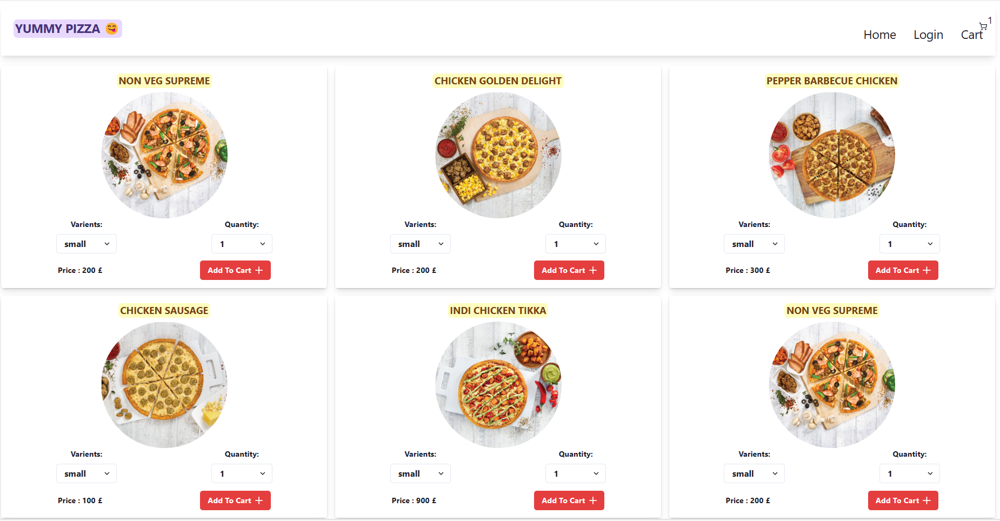
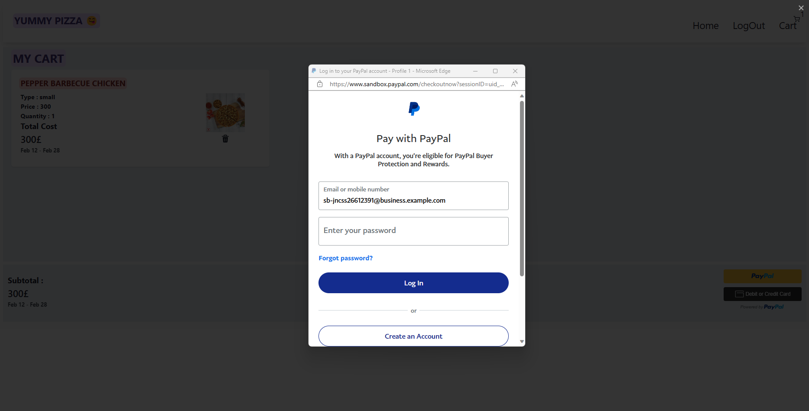
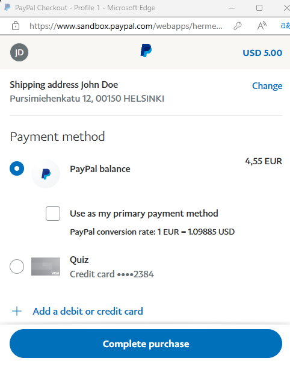
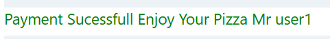

# Pizza App with PayPal Integration - README

<!--  -->





Welcome to the Pizza App! This application allows users to conveniently order pizzas of their choice, select different sizes, and make payments using PayPal. Whether you're a pizza enthusiast or just craving a delicious slice, our app has got you covered.

Its a very simple app with to test api payments.

## Table of Contents

- [Pizza App with PayPal Integration - README](#pizza-app-with-paypal-integration---readme)
  - [Table of Contents](#table-of-contents)
  - [Features](#features)
  - [Installation](#installation)
  - [Usage](#usage)
  - [PayPal Integration](#paypal-integration)
  - [Contributing](#contributing)
  - [ScreenShots](#screenshots)
  - [Reference Link](#reference-link)
  - [License](#license)

## Features

- Browse through a variety of pizza options.
- Choose different sizes for each pizza.
- Add pizzas to the cart and review the order.
- Seamlessly proceed to payment using PayPal.
- Receive order confirmation and payment details via email.

## Installation

1. Clone this repository to your local machine using:

   ```
   git clone https://github.com/bk201grsameer/FoodApp.git
   ```

2. Navigate to the project directory:

   ```
   cd FoodApp
   ```

3. Install the required dependencies:

   ```
   npm install
   ```

4. Set up your environment variables. Create a `.env` file in the root directory and add the following:

   ```
   PAYPAL_CLIENT_ID=your_paypal_client_id
   ```

   Replace `your_paypal_client_id` with your actual PayPal client ID.

5. Start the application:

   ```
   npm start
   ```

6. Access the app through your web browser at `http://localhost:5000`.

## Usage

1. Browse the list of available pizzas and click on a pizza to view details.
2. Select the desired size and specify the quantity.
3. Click the "Add to Cart" button.
4. Review your order by clicking on the cart icon.
5. Click the "Proceed to Checkout" button.
6. You'll be redirected to PayPal for payment processing.
7. After successful payment, you'll receive an confirmation with your order details.

## PayPal Integration

This app utilizes PayPal for secure and hassle-free payment processing. We've integrated PayPal's REST API to handle transactions. The provided PayPal client ID in the `.env` file is used for authentication.

Make sure to have a PayPal business account and create a REST API app to obtain the client ID. Refer to the [PayPal Developer Documentation](https://developer.paypal.com/docs/business/get-started/) for more information on setting up PayPal integration.

## Contributing

We welcome contributions to enhance the functionality of our Pizza App. Here's how you can contribute:

1. Fork this repository to your own GitHub account.
2. Create a new branch with a descriptive name: `git checkout -b feature/my-new-feature`.
3. Make your desired changes and commits.
4. Push the changes to your branch: `git push origin feature/my-new-feature`.
5. Submit a pull request detailing your changes.


## ScreenShots
1. *Fig 1: Making payment using developer paypal*


2. *Fig 2: Completing payment*


1. *Fig 2: Finalized*




## Reference Link
https://www.youtube.com/watch?v=v2ob3bpaLP8&pp=ygUQcGl6emEgYXBwIGNsb25lIA%3D%3D
   
## License

This project is licensed under the [MIT License](LICENSE).

---

Enjoy your pizza ordering experience with the Pizza App! If you encounter any issues or have suggestions for improvements, please feel free to open an issue or contribute to the project. Happy pizza eating! 🍕